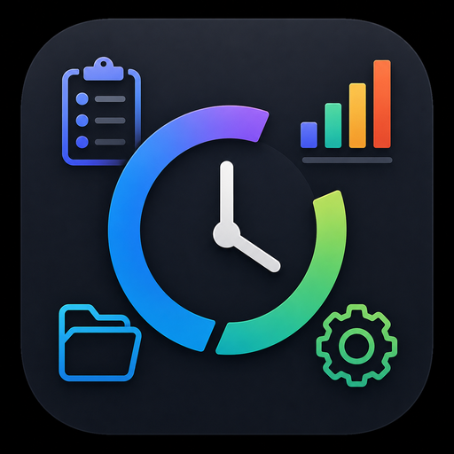

<div align="center">



# ProjectFlow

**Hub pessoal para controle de tempo, produtividade, custos e evolução de projetos no macOS.**

App nativo construído com SwiftUI e SwiftData — pensado para desenvolvedores, makers e pesquisadores que precisam enxergar *onde* o tempo vai e *quanto* cada projeto custa.

[]()
[]()
[]()
[]()
[]()

[Funcionalidades](#-funcionalidades) · [Instalação](#-instalação) · [Uso](#-uso-rápido) · [Sincronização](#-sincronização-icloud-drive) · [Arquitetura](#-arquitetura)

</div>

---

## Sobre

O **ProjectFlow** centraliza tudo o que você precisa para gerir projetos pessoais ou profissionais em um único app macOS:

- Rastrear horas com timer global ou Pomodoro
- Organizar projetos, tarefas, tags e metas
- Calcular valor investido com base na sua taxa horária
- Exportar relatórios em CSV, Excel e PDF
- Sincronizar dados entre MacBooks via pasta no iCloud Drive — **sem conta Apple Developer paga**

Os dados ficam **100% locais** por padrão. A sincronização é opcional e usa um arquivo JSON na pasta que você escolher.

---

## Funcionalidades

### Projetos e tarefas

| Recurso | Descrição |
|---------|-----------|
| **Projetos** | Nome, descrição, categoria, status, cor, ícone e taxa horária |
| **Tarefas** | Prioridade, status, horas estimadas e **horas já trabalhadas** (para registrar tempo feito antes do timer) |
| **Ordenação** | Projetos e tarefas podem ser ordenados por prioridade, alfabética, data de início, horas, status e valor |
| **Filtros** | Filtro por status na lista de projetos |

### Tempo e produtividade

| Recurso | Descrição |
|---------|-----------|
| **Timer global** | Inicie/pare o cronômetro por projeto e tarefa; persiste apenas ao parar |
| **Menu Bar** | Acompanhe e controle o timer direto da barra de menus |
| **Pomodoro** | Sessões focadas com modos de trabalho e pausa |
| **Histórico** | Log de atividades com ações registradas automaticamente |

### Análise e relatórios

| Recurso | Descrição |
|---------|-----------|
| **Dashboard** | Visão do dia: horas, projetos ativos, tarefas concluídas e gráficos |
| **Relatórios** | Tempo por projeto/tarefa com filtros por dia, semana, mês, ano ou projeto |
| **Métricas** | Estatísticas avançadas de produtividade |
| **Valor do projeto** | Custo investido vs. estimado com base na taxa horária |
| **Exportação** | CSV, Excel (`.xlsx`) e PDF |

### Organização

| Recurso | Descrição |
|---------|-----------|
| **Tags** | Etiquetas reutilizáveis associadas a projetos |
| **Metas** | Objetivos por período (diário, semanal, mensal) |
| **Integrações** | Arquitetura preparada para GitHub, GitLab, GitKraken, PocketBase e CloudKit *(em breve)* |

### Sincronização iCloud Drive

- Escolha uma pasta no iCloud Drive (ex.: `ProjectFlow/`)
- Merge automático **last-write-wins** por `syncId` + `updatedAt`
- Polling a cada ~10 segundos + sync após alterações
- Bloqueio de timer se outro Mac tiver sessão ativa
- Funciona com o **mesmo Apple ID** em vários MacBooks, sem CloudKit pago

---

## Capturas de tela

> Adicione screenshots aqui antes de publicar — sugestão de nomes na pasta `docs/screenshots/`:
>
> `dashboard.png` · `projects.png` · `timer.png` · `reports.png` · `sync.png`

<!--
<div align="center">
  
  <br><br>
  
</div>
-->

---

## Requisitos

| Item | Versão |
|------|--------|
| **macOS** | 26.0 ou superior |
| **Xcode** | 26+ (Swift 6) |
| **Conta Apple** | Opcional — só necessária para sincronização via iCloud Drive |

---

## Instalação

### 1. Clonar o repositório

```bash
git clone https://github.com/rogeriopires/ProjectFlow.git
cd ProjectFlow
```

### 2. Abrir no Xcode

```bash
open ProjectFlow.xcodeproj
```

### 3. Compilar e executar

1. Selecione o scheme **ProjectFlow**
2. Escolha **My Mac** como destino
3. Pressione **⌘R**

> O app roda em sandbox macOS. Os dados locais ficam em:
> `~/Library/Containers/com.rogeriocpires.ProjectFlow/Data/`

---

## Uso rápido

### Criar um projeto

1. Abra **Projetos** na sidebar
2. Clique em **Novo Projeto**
3. Defina nome, categoria, taxa horária e status

### Registrar tempo

**Opção A — Timer**
1. Vá em **Timer**
2. Selecione projeto e tarefa
3. Clique em **Iniciar** — o tempo é salvo ao **parar**

**Opção B — Horas já trabalhadas**
1. Ao criar/editar uma tarefa, preencha **Horas já trabalhadas**
2. Ideal para registrar trabalho feito antes de usar o app

**Opção C — Pomodoro**
1. Abra **Pomodoro**, configure a sessão e inicie

### Exportar relatório

1. Abra **Relatórios**
2. Escolha o período e o formato (CSV / Excel / PDF)
3. Salve o arquivo onde quiser

---

## Sincronização iCloud Drive

Ideal para usar o ProjectFlow em **dois ou mais MacBooks** com o mesmo Apple ID.

```
MacBook A                          iCloud Drive                    MacBook B
┌─────────────┐    sync JSON    ┌──────────────────┐    sync JSON    ┌─────────────┐
│ ProjectFlow │ ◄──────────────►│ ProjectFlow/     │◄──────────────►│ ProjectFlow │
│  (local DB) │                 │   data.json      │                 │  (local DB) │
└─────────────┘                 └──────────────────┘                 └─────────────┘
```

### Passo a passo

1. Crie uma pasta `ProjectFlow` no **iCloud Drive**
2. No app: **Sistema → Sincronização → Escolher pasta…**
3. Selecione essa pasta
4. Repita no segundo Mac, apontando para a **mesma pasta**
5. Aguarde o ícone de nuvem ficar sólido antes de abrir nos dois Macs ao mesmo tempo

> **Dica:** se um Mac tiver o timer ativo, o outro exibe um aviso e bloqueia o início de nova sessão para evitar conflitos.

---

## Atalhos de teclado

| Atalho | Ação |
|--------|------|
| `⌘⇧N` | Novo projeto |

---

## Arquitetura

```
ProjectFlow/
├── App/                  # AppState, ModelContainer
├── Models/               # SwiftData (@Model) + enums + DTOs de sync
├── Services/             # Timer, Pomodoro, Métricas, Export, Sync, Logger
├── Views/                # SwiftUI por módulo (Dashboard, Projects, Timer…)
└── Utilities/            # Formatadores, helpers, extensões
```

**Padrões adotados:**

- **MVVM** com `@Observable` (Observation framework)
- **SwiftData** para persistência local
- **NavigationSplitView** como layout principal
- **MenuBarExtra** para timer na barra de menus
- Sync via **JSON + security-scoped bookmark** (sem SQLite no iCloud)

---

## Stack técnico

| Camada | Tecnologia |
|--------|------------|
| Linguagem | Swift 6 |
| UI | SwiftUI |
| Persistência | SwiftData |
| Gráficos | Swift Charts |
| Sync | iCloud Drive + JSON (merge LWW) |
| Concorrência | `@MainActor`, `async/await`, `Task` |
| Plataforma | macOS 26+ (sandbox) |

---

## Roadmap

- [ ] Integração com GitHub (commits e issues)
- [ ] Integração com GitLab
- [ ] CloudKit como alternativa de sync
- [ ] Widgets e Live Activities
- [ ] Versão iOS / iPadOS

Contribuições e sugestões são bem-vindas — veja [Contribuindo](#contribuindo).

---

## Contribuindo

1. Faça um fork do projeto
2. Crie uma branch: `git checkout -b feature/minha-feature`
3. Commit: `git commit -m "feat: descrição clara da mudança"`
4. Push: `git push origin feature/minha-feature`
5. Abra um Pull Request

**Convenções:**

- Swift 6 com tipagem estrita
- UI em português (pt-BR)
- Mantenha o escopo mínimo — uma feature por PR
- Teste no macOS antes de submeter

---

## Licença

Este projeto está sob a licença **MIT**. Veja o arquivo [LICENSE](LICENSE) para detalhes.

---

## Autor

**Rogério Pires**

- GitHub: [@rogeriopires](https://github.com/rogeriopires)

---

<div align="center">

Feito com Swift no macOS

**ProjectFlow** — saiba onde seu tempo vai.

</div>
